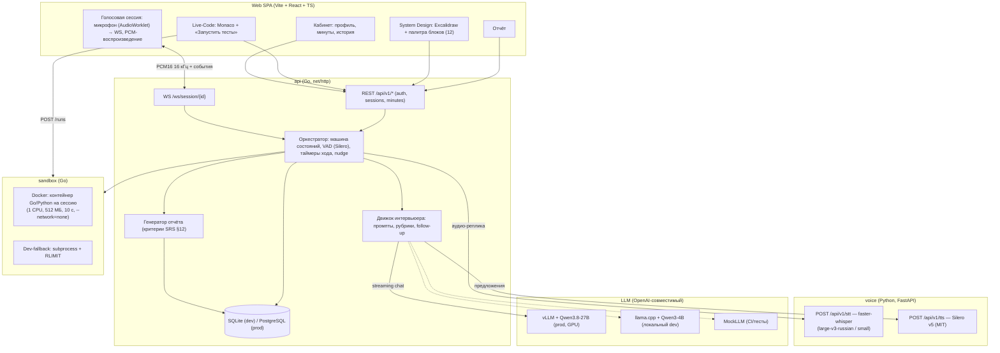
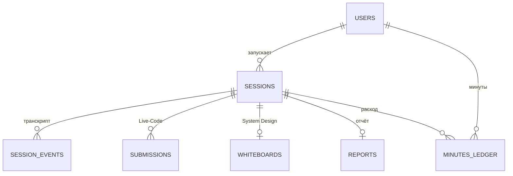
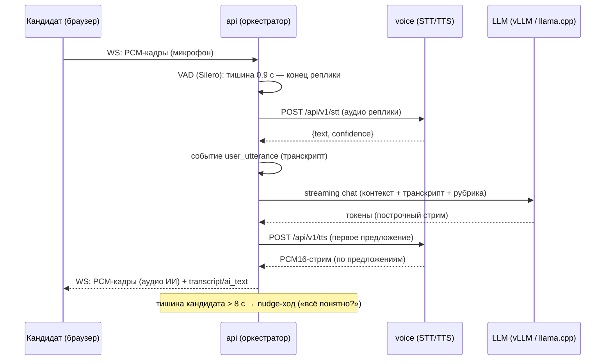
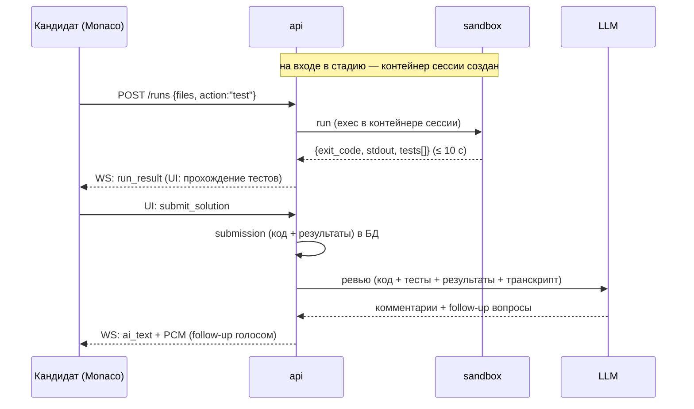
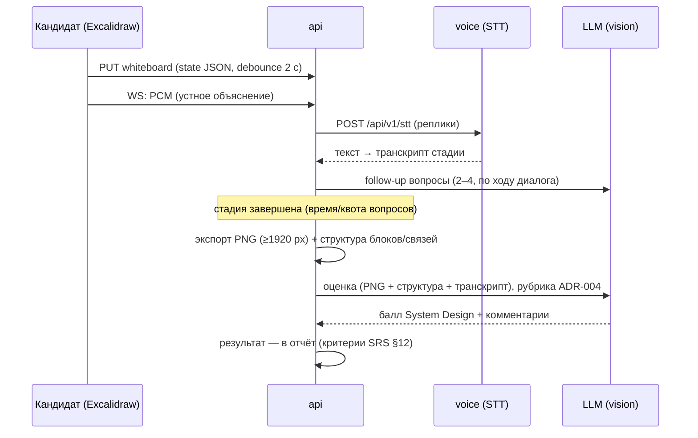

# ARCHITECTURE.md — архитектура сервиса «Грейд»

> **Статус: v0.4 (2026-09-09, фаза Design).** Решения — ADR-001…006 (`docs/adr/`).
> История: v0.1 черновик (Discovery) → v0.2 (голосовой стек) → v0.3 (Design: модель данных,
> API-контракты, sequence-диаграммы, топологии деплоя) → v0.4 (бекэнд Go: api/sandbox;
> voice — Python ML, ADR-006).

## 1. Компоненты

Примечание: VAD (Silero) — в оркестраторе `api` (управление ходом речи, ADR-002);
`voice` — безсостоятельные провайдеры STT/TTS, подменяемые через `/api/v1/*` (решение #16).

## 2. Топологии развёртывания

### 2.1. Продакшен (docker-compose, profile `gpu`)
Рантайм-цель — **отдельные серверы в локальной сети** (dev-машина не используется):
- **AI-узел (отдельный сервер в ЛВС, с GPU)**: vLLM (Qwen3.8-27B, fp8/int8, 80 ГБ VRAM)
  + voice (faster-whisper large-v3-russian, CUDA; Silero v5) — LLM и голосовые модели
  (STT/TTS) размещены на одном сервере: весь AI-контур централизован.
- **App-узел**: api, sandbox (Docker-демон), frontend (статика, nginx), PostgreSQL.
- Узлы общаются по ЛВС: LLM — OpenAI-совместимый API, voice — `/api/v1/stt|tts`;
  адрес AI-узла api знает только из конфига (`LLM_BASE_URL`, `VOICE_URL`).
- Ёмкость: 2–4 параллельные сессии на AI-узел (ADR-005), ≥ 5 активных сессий (NFR-2).

### 2.2. Локальный dev (dev-машина, convenience-режим — НЕ рантайм-цель)
| Сервис | Порт | Примечание |
|---|---|---|
| frontend (Vite dev) | 5173 | прокси `/api` → 8000, `/ws` → 8000 |
| api (Go) | 8000 | SQLite (modernc, без cgo), VAD (Silero, CPU) |
| voice | 8100 | STT `small` (CPU), TTS Silero v5 (CPU) |
| sandbox | 8200 | Docker Desktop или `SANDBOX_MODE=subprocess` |
| LLM | 8300 | llama.cpp + Qwen3-4B (Metal) или MockLLM в тестах |

## 3. Модель данных

| Таблица | Поля (основные) |
|---|---|
| `users` | id, email (unique), password_hash, created_at, minutes_free=3600 |
| `sessions` | id, user_id, grade, stack, stage (voice/livecode/design/report), status (active/paused/finished/aborted), duration_limit_s (45/50/60/75×60), active_seconds, paused_at, started_at, finished_at |
| `session_events` | id, session_id, seq, ts, kind (stage_change/user_utterance/ai_utterance/ai_nudge/code_run/whiteboard_save/timer/degraded_text_mode), data JSONB |
| `submissions` | id, session_id, task_id, files JSONB (path→content), action, exit_code, stdout, stderr, duration_ms, tests JSONB, created_at |
| `whiteboards` | id, session_id, state JSONB (Excalidraw elements+appState), blocks JSONB (извлечённая структура), png_path, updated_at |
| `reports` | id, session_id, overall (взвешенный балл), grade_recommendation, criteria JSONB (критерий→балл), strengths[], weaknesses[], recommendations[], created_at |
| `minutes_ledger` | id, user_id, session_id, delta_seconds (+3600 грант / −расход), reason, created_at |

Остаток минут пользователя = `SUM(delta_seconds)` по ledger (включая стартовый грант 60 мин).

## 4. Контракты API

### 4.1. REST (`api`)
| Метод | Путь | Назначение |
|---|---|---|
| POST | /api/v1/auth/register | `{email, password}` → `{token}` (JWT) |
| POST | /api/v1/auth/login | `{email, password}` → `{token}` |
| GET | /api/v1/me | профиль + `minutes_remaining_s` |
| GET | /api/v1/sessions | список (дата, грейд, стек, оценка, статус) |
| POST | /api/v1/sessions | `{grade, stack}` → `{id, ws_url, duration_limit_s}`; при 0 минут — 402 |
| GET | /api/v1/sessions/{id} | состояние: stage, status, time_left_s, task (если назначена) |
| POST | /api/v1/sessions/{id}/pause · /resume · /finish | управление (FR-S6, FR-B4, US-8) |
| POST | /api/v1/sessions/{id}/runs | `{files, action:"test"}` → результат (4.4) |
| PUT | /api/v1/sessions/{id}/whiteboard | `{state, png?}` — сохранение холста |
| GET | /api/v1/sessions/{id}/report | отчёт (202, пока генерируется) |
| GET | /api/v1/sessions/{id}/events | транскрипт/события (история, FR-A4) |

### 4.2. WS `/ws/session/{id}` (протокол, ADR-001)
- **C→S**: бинарные кадры — PCM16 16 кГц mono, ~250 мс; текстовые:
  `{"type":"ui","name":"stage_action|whiteboard_saved|code_run_requested|submit_solution|finish","payload":{...}}`
- **S→C** (JSON):
  `{"type":"transcript","who":"user|ai","text":...,"ts":...}` ·
  `{"type":"stage","name":"voice|livecode|design|report","task":{...}}` (task: условие задачи
  Live-Code / задача System Design) ·
  `{"type":"ai_text","text":...}` (полный ответ ИИ) ·
  `{"type":"run_result","exit_code":...,"stdout":...,"tests":[...],"duration_ms":...}` ·
  `{"type":"timer","remaining_s":...}` (1 раз/5 с) ·
  `{"type":"report_ready"}` ·
  `{"type":"degraded","mode":"text","reason":...}` (FR-V8) ·
  `{"type":"error","code":...,"msg":...}`
- **S→C** (бинарные): кадры аудио ИИ — 4-байтный заголовок `{seq u16, flags u16}` + PCM16 16 кГц mono.

### 4.3. voice-сервис
| Метод | Путь | Контракт |
|---|---|---|
| POST | /api/v1/stt | multipart: `audio` (WAV/PCM16, 16 кГц) → `{"text","confidence","duration_s"}` |
| POST | /api/v1/tts | `{"text","speaker"}` → 200 `audio/pcm` (PCM16 16 кГц, chunked-стрим) |
| GET | /api/v1/health | `{"stt":{"model","device"},"tts":{"speakers":[]}}` |

### 4.4. sandbox-сервис
| Метод | Путь | Контракт |
|---|---|---|
| POST | /api/v1/sessions/{id}/runs | `{files{path:content}, action:"test"}` → `{exit_code, stdout, stderr, duration_ms, passed, tests[{name,passed}]}` (≤ 10 с, ADR-003) |

Жизненный цикл контейнера ведёт оркестратор: create — на входе в Live-Code, destroy — по
завершении сессии (fail-closed: без контейнера стадии Live-Code недоступна, 503).

## 5. Последовательности

### 5.1. Голосовой ход (стадия voice)

### 5.2. Live-Code: запуск тестов и ревью

### 5.3. System Design: схема и оценка

## 6. Конфигурация (.env) и наблюдаемость
| Переменная | По умолчанию | Описание |
|---|---|---|
| `DATABASE_URL` | sqlite:///./grade.db | PostgreSQL в prod |
| `ADDR` | :8000 | адрес прослушивания (api) |
| `JWT_SECRET` / `JWT_EXPIRY_HOURS` | — / 168 | JWT-аутентификация (WP-2) |
| `SANDBOX_URL` | http://localhost:8200 | адрес sandbox-сервиса |
| `LOG_LEVEL` | info | уровень логов (NFR-9) |
| `LLM_BASE_URL` / `LLM_MODEL` / `LLM_API_KEY` | http://localhost:8300/v1 / Qwen3-4B / "" | OpenAI-совместимый; prod: vLLM + Qwen3.8-27B на AI-узле (ЛВС) |
| `VOICE_URL` | http://localhost:8100 | Адрес AI-узла (voice: `/api/v1/stt|tts`); prod — IP в ЛВС |
| `STT_MODEL` | small (dev) / large-v3-russian (prod) | faster-whisper |
| `TTS_SPEAKER` | ru_01 | спикер Silero v5 |
| `VAD_END_SILENCE_MS` | 900 | конец реплики (700–1200) |
| `SILENCE_NUDGE_S` | 8 | заполнение паузы |
| `SANDBOX_MODE` | docker (prod) / subprocess (dev) | ADR-003 |
| `MINUTES_FREE_S` | 3600 | стартовый грант |
| `SESSION_PAUSE_TIMEOUT_S` | 1800 | финализация обрыва (SRS §7) |

Наблюдаемость (NFR-9): JSON-логи (Go — `log/slog`, voice — structlog) + Prometheus `/metrics`:
`turn_e2e_ms` (конец реплики → первый PCM-кадр ИИ; разбивка stt_ms/llm_ttfb_ms/tts_first_byte_ms),
`stt_errors_total`, `sessions_active`, `sandbox_runs_total{result}`, `gpu_util` (если доступно).
Алерты: p95 `turn_e2e_ms` > 6000 мс; `stt_errors` > 2%/5 мин; sandbox OOM/таймауты > 5/час.

## 7. История
- v0.1 (2026-09-09) — черновик Discovery, mermaid-компоненты.
- v0.2 (2026-09-09) — голосовой стек self-hosted (faster-whisper, Silero v5, Qwen3.8-27B).
- v0.3 (2026-09-09) — Design: ADR-001…005, модель данных, контракты API (REST/WS/voice/sandbox),
  sequence-диаграммы, топологии prod/dev, конфигурация, метрики.
- v0.4 (2026-09-09) — бекэнд на Go (api, sandbox; ADR-006), voice остаётся Python (ML).
- v0.4.1 (2026-09-10) — Implementation WP-1/WP-2: синхронизация §6 (ADDR, JWT_*, SANDBOX_URL,
  LOG_LEVEL), JSON-логи — log/slog (Go).
