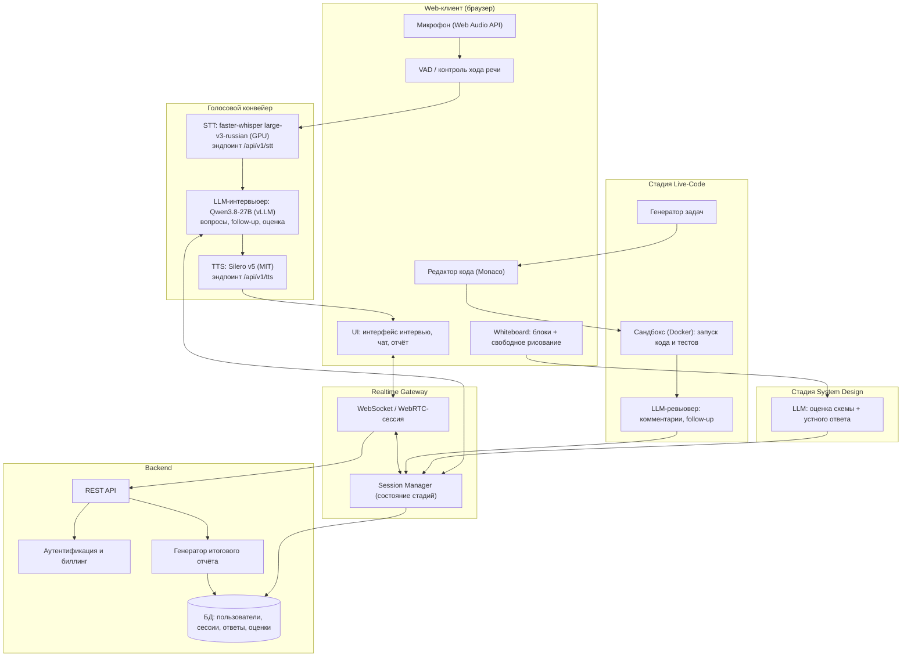

# ARCHITECTURE.md — архитектура сервиса мок-интервью «Грейд»

> **Статус: v0.2 (2026-09-09, фаза Discovery закрыта).** Голосовой стек определён:
> self-hosted (faster-whisper large-v3-russian, Silero v5, Qwen3.8-27B). Детальный дизайн —
> фаза Design (см. `roadmap.md`, Фаза 2).

## 1. Обзор
Web-сервис мок-интервью. Три основные стадии сессии:
1. **Голосовое интервью** — кандидат общается с ИИ-интервьюером «как на zoom»:
   микрофон → STT → LLM (интервьюер) → TTS → звук.
2. **Live-Code** (живой кодинг) — редактор кода (Monaco): задача, автоматические тесты,
   запуск кода в сандбоксе, ИИ-ревьюер с комментариями и follow-up вопросами.
3. **System Design** (Middle/Senior) — whiteboard: палитра готовых архитектурных
   блоков (БД, кэш, LB, очередь, микросервис…) + свободное рисование;
   ИИ оценивает схему и устный ответ кандидата.

## 2. Диаграмма компонентов (v0.1)

## 3. Ключевые технические решения (открытые, закрываются в Design)
| # | Вопрос | Кандидатуры | Примечание |
|---|--------|-------------|------------|
| 1 | Транспорт голоса | WebRTC (peer, низкий latency) vs WebSocket (упрощённо, сервер-сторона) | MVP: WebSocket с chunk-аудио — проще; WebRTC — как апгрейд |
| 2 | STT/TTS | **Решено (2026-09-09)**: self-hosted — faster-whisper large-v3-russian (GPU) / Silero v5 (MIT); /api/v1/stt, /api/v1/tts + абстракция провайдера | В MVP без облаков (требование пользователя) |
| 3 | LLM-интервьюер | **Решено (2026-09-09)**: Qwen3.8-27B self-hosted (vLLM, Apache 2.0) | Vision — оценка схем System Design по изображению |
| 4 | Сандбокс кода | Docker-контейнер на сервере vs WASM в браузере | Docker: честный runtime; WASM: дешевле, но ограничения по языкам |
| 5 | Whiteboard | Excalidraw-подобный холст + палитра блоков (drag&drop) | Гибрид «блоки + рисование» — кандидатура (см. опрос) |

## 4. Latency-модель голосового контура
`микрофон → STT (300–700 мс) → LLM (300–1500 мс) → TTS (200–500 мс)`
- MVP (ходовой диалог, кандидат говорит — ИИ отвечает): end-to-end **< 2–3 с** на ответ.
- Цель (full-duplex с barge-in): **< 1 с**, строгие требования к эхоподавлению и VAD.
- Оптимизации: streaming STT (частичные гипотезы), streaming LLM (первые токены →
  сразу в TTS по фразам), prefill-промпта, TTS по осломкам фраз.

## 5. Что уточнил опрос Discovery (2026-09-09)
Опрос проведён, ответы зафиксированы в `PROJECT_MEMORY.md` (решения #4–14):
только русский язык; живой диалог с заполнением пауз; MVP — Go + Python (все стадии);
LLM — Qwen3.8-27B (Apache 2.0, self-hosted); стадия Live-Code;
System Design = готовые блоки + свободное рисование; поминутная тарификация (без шлюза).
Остаток: подтверждение платформы (Web) и итоговый выбор провайдеров TTS/STT.
