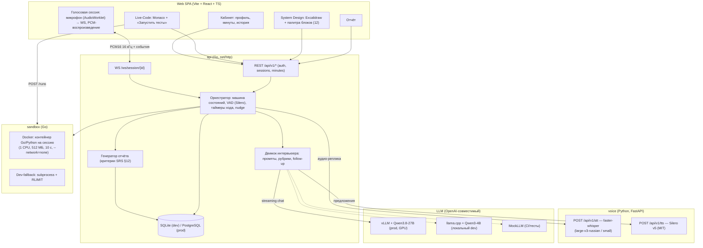
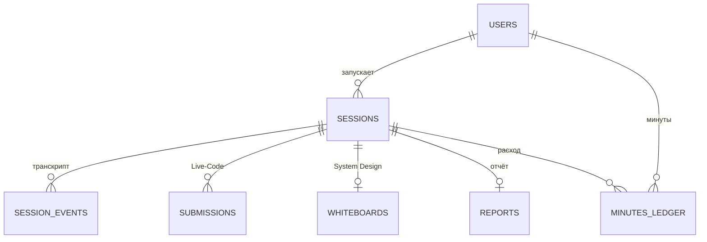
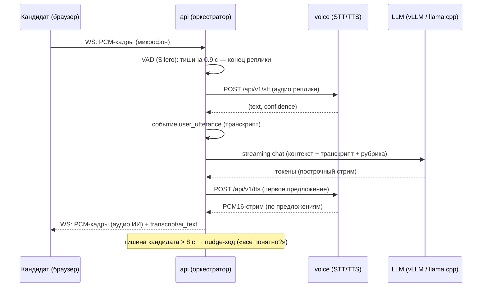
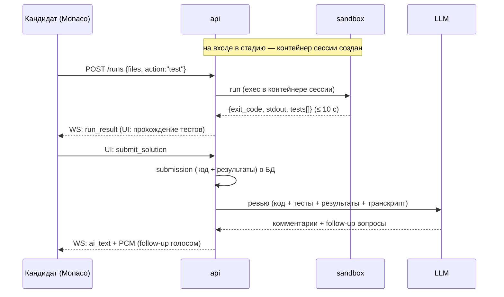
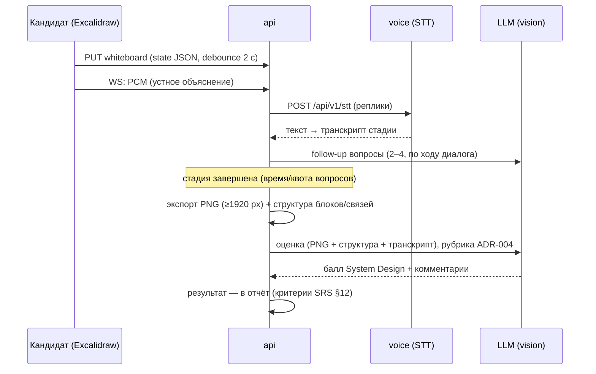

# ARCHITECTURE.md — архитектура сервиса «Грейд»

> **Статус: v0.4 (2026-09-09, фаза Design).** Решения — ADR-001…006 (`docs/adr/`).
> История: v0.1 черновик (Discovery) → v0.2 (голосовой стек) → v0.3 (Design: модель данных,
> API-контракты, sequence-диаграммы, топологии деплоя) → v0.4 (бекэнд Go: api/sandbox;
> voice — Python ML, ADR-006).

## 1. Компоненты

Примечание: VAD (Silero) — в оркестраторе `api` (управление ходом речи, ADR-002);
`voice` — безсостоятельные провайдеры STT/TTS, подменяемые через `/api/v1/*` (решение #16).

**SPA (frontend, WP-7 — базовый каркас кабинета)**: Vite + React 18 + TypeScript,
без фреймворков роутинга — hash-роутинг (корректно за nginx/статикой):
`#/` — кабинет (или вход/регистрация без авторизации), `#/sessions/{id}` — страница
сессии (метаданные + транскрипт из `/events`; голосовой интерфейс — WP-8). JWT — в
localStorage, каждый запрос — `Authorization: Bearer`; 401/403 на `/auth/me` —
разлогин. Минуты из `/auth/me` (`minutes_remaining_s`), старт сессии ограничен
балансом (лимит по грейду 45/50/60/75 мин). Dev-прокси Vite: `/api`, `/healthz`,
`/ws` → `:8000`; prod — nginx.conf (location `/api/`, `/healthz`, `/ws`).

## 2. Топологии развёртывания

### 2.1. Продакшен (docker-compose, profile `gpu`)
Рантайм-цель — **отдельные серверы в локальной сети** (dev-машина не используется):
- **AI-узел (отдельный сервер в ЛВС, с GPU)**: vLLM (Qwen3.8-27B, fp8/int8, 80 ГБ VRAM)
  + voice (faster-whisper large-v3-russian, CUDA; Silero v5) — LLM и голосовые модели
  (STT/TTS) размещены на одном сервере: весь AI-контур централизован.
- **App-узел**: api, sandbox (Docker-демон), frontend (статика, nginx), PostgreSQL.
- Узлы общаются по ЛВС: LLM — OpenAI-совместимый API, voice — `/api/v1/stt|tts`;
  адрес AI-узла api знает только из конфига (`LLM_BASE_URL`, `VOICE_URL`).
- Ёмкость: 2–4 параллельные сессии на AI-узел (ADR-005), ≥ 5 активных сессий (NFR-2).

### 2.2. Локальный dev (dev-машина, convenience-режим — НЕ рантайм-цель)
| Сервис | Порт | Примечание |
|---|---|---|
| frontend (Vite dev) | 5173 | прокси `/api` → 8000, `/ws` → 8000 |
| api (Go) | 8000 | SQLite (modernc, без cgo), VAD (Silero, CPU) |
| voice | 8100 | STT `small` (CPU), TTS Silero v5 (CPU) |
| sandbox | 8200 | Docker Desktop или `SANDBOX_MODE=subprocess` |
| LLM | 8300 | llama.cpp + Qwen3-4B (Metal) или MockLLM в тестах |

## 3. Модель данных

| Таблица | Поля (основные) |
|---|---|
| `users` | id, email (unique), password_hash, created_at, minutes_free=3600 |
| `sessions` | id, user_id, grade, stack, stage (voice/livecode/design/report), status (active/paused/finished/aborted), duration_limit_s (45/50/60/75×60), active_seconds, paused_at, started_at, finished_at |
| `session_events` | id, session_id, seq, ts, kind (session_created/stage_change/paused/resumed/finished/aborted/user_utterance/ai_utterance/ai_nudge/code_run/whiteboard_save/timer/degraded_text_mode), data JSONB |
| `submissions` | id, session_id, task_id, files JSONB (path→content), action, exit_code, stdout, stderr, duration_ms, tests JSONB, created_at |
| `whiteboards` | id, session_id, state JSONB (Excalidraw elements+appState), blocks JSONB (извлечённая структура), png_path, updated_at |
| `reports` | id, session_id, overall (взвешенный балл), grade_recommendation, criteria JSONB (критерий→балл), strengths[], weaknesses[], recommendations[], created_at |
| `minutes_ledger` | id, user_id, session_id, delta_seconds (+3600 грант / −расход), reason, created_at |

Остаток минут пользователя = `SUM(delta_seconds)` по ledger (включая стартовый грант 60 мин).

## 4. Контракты API

### 4.1. REST (`api`)
| Метод | Путь | Назначение |
|---|---|---|
| POST | /api/v1/auth/register | `{email, password}` → `{token}` (JWT) |
| POST | /api/v1/auth/login | `{email, password}` → `{token}` |
| GET | /api/v1/me | профиль + `minutes_remaining_s` |
| GET | /api/v1/sessions | список (дата, грейд, стек, оценка, статус) |
| POST | /api/v1/sessions | `{grade, stack}` → `{id, ws_url, duration_limit_s}`; при 0 минут — 402 |
| GET | /api/v1/sessions/{id} | состояние: stage, status, time_left_s, task (если назначена) |
| POST | /api/v1/sessions/{id}/pause · /resume · /finish | управление (FR-S6, FR-B4, US-8) |
| POST | /api/v1/sessions/{id}/runs | `{files, action:"test", task_id?}` → результат (4.4); только стадия `livecode`, иначе 409 |
| PUT | /api/v1/sessions/{id}/whiteboard | `{state, png?}` — сохранение холста |
| GET | /api/v1/sessions/{id}/report | отчёт (202, пока генерируется) |
| GET | /api/v1/sessions/{id}/events | транскрипт/события (история, FR-A4) |

### 4.2. WS `/ws/session/{id}` (протокол, ADR-001)
- **Аутентификация (WP-3)**: JWT — query-параметр `?token=...` (браузеры) или заголовок
  `Authorization: Bearer`; при невалидном/отсутствующем токене — 401 **до** апгрейда.
  Обрыв соединения ставит активную сессию в `paused` (FR-S7).
- **C→S**: бинарные кадры — PCM16 16 кГц mono, ~250 мс; текстовые:
  `{"type":"ui","name":"stage_action|whiteboard_saved|code_run_requested|submit_solution|finish|utterance","payload":{...}}`
  (`stage_action` → `{stage}`; `utterance` → `{text}` — текстовый режим/FR-V8 и тесты)
- **S→C** (JSON):
  `{"type":"transcript","who":"user|ai","text":...,"ts":...}` ·
  `{"type":"stage","name":"voice|livecode|design|report","task":{...}}` (task: условие задачи
  Live-Code / задача System Design) ·
  `{"type":"ai_text","text":...}` (полный ответ ИИ) ·
  `{"type":"run_result","exit_code":...,"stdout":...,"tests":[...],"duration_ms":...}` ·
  `{"type":"timer","remaining_s":...}` (1 раз/5 с) ·
  `{"type":"report_ready"}` ·
  `{"type":"degraded","mode":"text","reason":...}` (FR-V8) ·
  `{"type":"error","code":...,"msg":...}`
- **S→C** (бинарные): кадры аудио ИИ — 4-байтный заголовок `{seq u16 LE, flags u16 LE}`
  (все little-endian) + PCM16 16 кГц mono; `seq` — индекс кадра в потоке реплики
  (с 0 на каждую новую реплику), `flags` bit0 (0x01) — последний кадр потока.
  Кадры по 250 мс (8000 байт). Реализовано (шаг «голосовой конвейер»): стримит
  `engine.SendBinary` (правило единственного писателя), источники — приветствие,
  ответы на реплики (TTS).
- **Оркестрация (WP-5)**: `utterance` → движок интервьюера (LLM, ADR-005) → `ai_text`
  + события `user_utterance`/`ai_utterance` (бессостойный к рестарту: контекст — из БД).
  Приветствие — на подключении к новой сессии (stage voice, нет `ai_utterance`);
  вход на `livecode` — `stage`-сообщение с `task` из банка sandbox + `ai_text`-комментарий;
  вход на `design` — `ai_text`-представление стадии. Молчание > `SILENCE_NUDGE_S` на
  активной voice-сессии → nudge-ход (`ai_text` + событие `ai_nudge`). Неудача LLM →
  стандартная fallback-реплика (`ai_text`), сессия не прерывается (FR-V8).
  PCM-кадры считаются активностью (анти-nudge); голосовой конвейер VAD+STT — WP-4/8.
  `LLM_MOCK=1` — детерминированный мок (dev без LLM-узла, CI).
- **Голосовой конвейер (ADR-002, шаг 2026-09-14)**: бинарные кадры кандидата (PCM16,
  ~250 мс) → энергетический VAD в api (`internal/vad`, порог RMS `VAD_RMS_THRESHOLD`,
  конец реплики по тишине `VAD_END_SILENCE_MS`, реплика < `MinSpeechMS` — шум,
  >= `MaxSpeechMS` — срез) → `voice /stt` (multipart) → ход кандидата (текстовый путь и
  `utterance` — одна функция `runCandidateTurn`) → `voice /tts` → бинарные кадры S→C.
  Ходовой режим (SRS §8): пока конвейер занят или ИИ «говорит» (TTS-стрим),
  микрофон не слушается (barge-in — вне скоупа); следующий голосовой ход один
  (повторные реплики в буфере VAD теряются). Сбой voice-сервиса — только warn-лог,
  текстовый режим (`utterance`) продолжает работать. Точная VAD-модель (Silero onnx
  в Go) — бэклог (в voice-сервисе VAD-фильтр STT уже есть).

### 4.3. voice-сервис (WP-4)
| Метод | Путь | Контракт |
|---|---|---|
| POST | /api/v1/stt | multipart: `audio` (raw PCM16 или WAV, 16 кГц) + опц. `sample_rate` → `{"text","confidence","duration_s"}`; молчание/ошибка → `text=""` (не 500) |
| POST | /api/v1/tts | `{"text","speaker?"}` → 200 `audio/pcm` (PCM16 mono 16 кГц, чанки ~250 мс; заголовки X-Sample-Rate/Channels/Bits); пустой текст → 400 |
| GET | /api/v1/health | `{"stt":{"provider","model","device","loaded"},"tts":{"provider","model","speakers","loaded"}}` |

Провайдеры (решение #16): faster-whisper (STT, ленивая загрузка модели `STT_MODEL`, VAD-фильтр
против галлюцинаций на тишине) / Silero v5 (TTS, 5 рус. спикеров; нативные 24 кГц →
ресемплинг в контрактные 16 кГц). `VOICE_STT_PROVIDER`/`VOICE_TTS_PROVIDER`:
`faster-whisper`/`silero` (default) или `fake` (CI без ML-моделей).

### 4.4. sandbox-сервис (WP-6)
| Метод | Путь | Контракт |
|---|---|---|
| POST | /api/v1/sessions/{id}/runs | `{stack:"go"\|"python", files{path:content}, action:"test", task_id?}` → `{exit_code, stdout, stderr, duration_ms, passed, timeout, tests[{name,passed}]}` (≤ 10 с, ADR-003) |
| GET | /api/v1/tasks?stack=&grade= | банк задач: `[{id, stack, grades[], title, statement, files}]` |
| GET | /healthz | `{status, service, mode, tasks}` |

**Режимы (ADR-003).** `SANDBOX_MODE=docker` — `docker run --rm --network=none --cpus=1
--memory=512m --pids-limit=128 --read-only --tmpfs /tmp:size=128m --user 1000:1000`
(образы `golang:1.24` / `python:3.12-slim`); без docker-демона — fail-closed, 503.
`SANDBOX_MODE=subprocess` (dev-по-умолчанию) — интерпретатор хоста в изолированном cwd
(рабочие каталоги **не в /tmp**: Go игнорирует `go.mod` в системном temp-root),
минимальный env, таймаут 10 с (убийство группы процессов), ограничение вывода 1 МБ,
`GOPROXY=off`. Команды: Go — `go test -count=1 -json ./...` (tests[] — парсинг `-json`),
Python — `python3 -m pytest -q`.

**Банк задач** — 12 задач (6 Go + 6 Python), теги по грейдам, `go:embed`; зависимости —
только stdlib (сеть в контейнере запрещена). Задача: стартовый `solution.*` (стуб) +
скрытые тесты; `task_id` в `/runs` — валидация по банку и запись в `submissions`.

api-прокси: `POST /api/v1/sessions/{id}/runs` (requireAuth, стадия `livecode`) → sandbox
`SANDBOX_URL` (15 с) → сохранение в `submissions` + событие `code_run` + `run_result` по WS.
**Отклонение от ADR-003 (MVP):** контейнер на каждый run (простота); long-lived контейнер
на сессию — бэклог Operations.

## 5. Последовательности

### 5.1. Голосовой ход (стадия voice)

### 5.2. Live-Code: запуск тестов и ревью

### 5.3. System Design: схема и оценка

## 6. Конфигурация (.env) и наблюдаемость
| Переменная | По умолчанию | Описание |
|---|---|---|
| `DATABASE_URL` | sqlite:///./grade.db | PostgreSQL в prod |
| `ADDR` | :8000 | адрес прослушивания (api) |
| `JWT_SECRET` / `JWT_EXPIRY_HOURS` | — / 168 | JWT-аутентификация (WP-2) |
| `SANDBOX_URL` | http://localhost:8200 | адрес sandbox-сервиса |
| `LOG_LEVEL` | info | уровень логов (NFR-9) |
| `LLM_BASE_URL` / `LLM_MODEL` / `LLM_API_KEY` | http://localhost:8300/v1 / Qwen3-4B / "" | OpenAI-совместимый (ADR-005); prod: vLLM + Qwen3.8-27B на AI-узле (ЛВС) |
| `LLM_MOCK` | "" | `1` — детерминированный LLM-мок (dev без LLM-узла, CI) |
| `VAD_RMS_THRESHOLD` | 500 | VAD: порог RMS int16 — выше «речь есть» (шаблон: голос ~1000–10000, тишина < 200) |
| `VOICE_URL` | http://localhost:8100 | Адрес AI-узла (voice: `/api/v1/stt|tts`); prod — IP в ЛВС |
| `STT_MODEL` | small (dev) / large-v3-russian (prod) | faster-whisper |
| `TTS_SPEAKER` | ru_01 | спикер Silero v5 |
| `VAD_END_SILENCE_MS` | 900 | конец реплики (700–1200) |
| `SILENCE_NUDGE_S` | 8 | заполнение паузы |
| `SANDBOX_MODE` | docker (prod) / subprocess (dev) | ADR-003 |
| `MINUTES_FREE_S` | 3600 | стартовый грант |
| `SESSION_PAUSE_TIMEOUT_S` | 1800 | финализация обрыва (SRS §7) |

Наблюдаемость (NFR-9): JSON-логи (Go — `log/slog`, voice — structlog) + Prometheus `/metrics`:
`turn_e2e_ms` (конец реплики → первый PCM-кадр ИИ; разбивка stt_ms/llm_ttfb_ms/tts_first_byte_ms),
`stt_errors_total`, `sessions_active`, `sandbox_runs_total{result}`, `gpu_util` (если доступно).
Алерты: p95 `turn_e2e_ms` > 6000 мс; `stt_errors` > 2%/5 мин; sandbox OOM/таймауты > 5/час.

## 7. История
- v0.4.6 (2026-09-14) — Implementation WP-7 (базовая часть): §1 — SPA-каркас
  кабинета (hash-роутинг, views: вход/регистрация, кабинет (профиль, минуты,
  «новое интервью», история), страница сессии (транскрипт)); типизированный
  API-клиент (localStorage-JWT, ApiError по кодам), dev-прокси + nginx `/healthz`.
- v0.1 (2026-09-09) — черновик Discovery, mermaid-компоненты.
- v0.2 (2026-09-09) — голосовой стек self-hosted (faster-whisper, Silero v5, Qwen3.8-27B).
- v0.3 (2026-09-09) — Design: ADR-001…005, модель данных, контракты API (REST/WS/voice/sandbox),
  sequence-диаграммы, топологии prod/dev, конфигурация, метрики.
- v0.4 (2026-09-09) — бекэнд на Go (api, sandbox; ADR-006), voice остаётся Python (ML).
- v0.4.1 (2026-09-10) — Implementation WP-1/WP-2: синхронизация §6 (ADDR, JWT_*, SANDBOX_URL,
  LOG_LEVEL), JSON-логи — log/slog (Go).
- v0.4.2 (2026-09-13) — Implementation WP-3: §4.2 — auth WS (token/Bearer, 401 до апгрейда),
  ui-событие `utterance`; §3 — расширение kind в session_events (session_created/paused/resumed/
  finished/aborted); пауза > порога → aborted (SESSION_PAUSE_TIMEOUT_S).
- v0.4.3 (2026-09-14) — Implementation WP-6: §4.4 — контракт sandbox (stack/files/task_id,
  `timeout` в ответе, GET /api/v1/tasks, банк 12 задач go:embed), режимы docker/subprocess
  (рабочие каталоги вне /tmp — ограничение Go), api-прокси /runs + submissions + `code_run`
  + `run_result` по WS; MVP-отклонение: контейнер на run (long-lived — бэклог).
- v0.4.5 (2026-09-14) — Implementation «голосовой конвейер» (ADR-002): §4.2 —
  контракт бинарных кадров ({seq,flags} LE, 250 мс) и пайплайн PCM→VAD→STT→LLM→TTS→кадры
  (turn-taking, один параллельный ход, sбой voice — graceful degradation),
  `engine.SendBinary`, `internal/vad` (энергетический VAD), `internal/voicesvc` (клиент
  /stt-/tts); §6 — VAD_RMS_THRESHOLD.
- v0.4.4 (2026-09-14) — Implementation WP-4/WP-5: §4.3 — voice-контракты реализованы
  (raw PCM/WAV, loaded-флаги, fake-режим, Silero v5 + ресемплинг 24→16 кГц); §4.2 —
  оркестрация интервьюера (utterance → ai_text, приветствие, task на livecode, nudge по
  SILENCE_NUDGE_S, LLM-fallback — FR-V8); §6 — LLM_MOCK; .env.example — полный набор.
